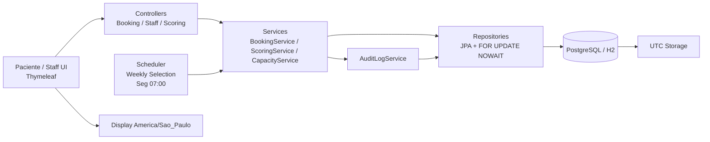

# PRIORIZASUS — Agendamento inteligente e prioritário, sem filas

Sistema de agendamento para clínicas ESF (Estratégia Saúde da Família). Substitui a fila de madrugada por uma seleção semanal com critérios clínicos e prioridade para quem mais precisa.

---

## 1. Problema

Um médico atende **2.500 pacientes** com apenas **40 vagas semanais** (30 minutos cada, total de 20 horas/semana). Sem priorização, quem tem maior urgência clínica, gestantes em fase avançada, recém-nascidos em puericultura, hipertensos e diabéticos em atraso, disputa vaga em pé de igualdade com casos de menor gravidade. O resultado: filas de madrugada e desperdício de capacidade.

**Solução:** um algoritmo justo de Seleção Semanal. Toda segunda-feira às 7h, o sistema calcula um **Score** para cada paciente com base em:

- **Peso da categoria clínica** — pré-natal (200–1000 pts conforme semanas gestacionais), puericultura (400–900 pts conforme idade), crônicos (200 pts)
- **Dias de atraso** em relação à janela alvo (`daysOverdue × 10 pts`, até 500 por categoria)

Os **40 pacientes com maior Score** ganham o direito de agendar naquela semana. Quem não entra, acumula mais dias de atraso e sobe no ranking da semana seguinte, ninguém fica para trás para sempre.

---

## 2. Como a IA foi usada

### Ferramentas

- **GitHub Copilot Chat** — especificação, código, arquitetura, refatoração, testes e documentação.
- **GitHub Actions** — pipelines com validações automáticas (`ai-plan`, `ai-build`, `ai-review`, `spec-drift-check`, `evidence-log`).
- **[TLC Spec-Driven](https://agent-skills.techleads.club/skills/tlc-spec-driven/)** — é a aplicação prática do Spec-Driven Development: cada feature começa pela especificação, não pelo código. Organiza cada feature em 3 artefatos: `spec.md` (requisitos + critérios de aceite), `design.md` (decisões técnicas) e `tasks.md` (tarefas). **Uso:** `.specs/` com 9 arquivos, 5 features. REQ-IDs rastreados até o código via `@ReqId("XX-NNN")` e validados por `ai-plan.yml` + `SpecDriftDetectionTest`.
- **[Grill-with-Docs](https://www.aihero.dev/grill-with-docs)** (Matt Pocock) — sessão de entrevista que questiona o plano, afina a terminologia e atualiza documentação em tempo real. **Uso:** 16 decisões documentadas em `docs/GRILL-DECISIONS.md`, entre elas: eliminação de WALK_IN (40/0 all-BATCH), definição de `daysOverdue`, lifecycle de slots e distinção `lastConsultationDate` vs `targetDate`. Gerou ADRs como ADR-0002 e ADR-0005.
- **[getdesign.md](https://getdesign.md/)** — repositório de arquivos `DESIGN.md` prontos, cada um documentando o design system de um site famoso (Notion, Vercel, Stripe etc.) em formato Markdown legível por IA. **Uso:** `DESIGN.md` na raiz com o design system da Notion — serviu como referência visual consistente (cores, tipografia, botões, cartões) para as telas Thymeleaf (staff dashboard, booking, ocupação).
- **Harness Engineering** (`docs/HARNESS.md`) — não é uma ferramenta ou pasta isolada, mas um sistema distribuído de qualidade que conecta especificação, documentação, skills e CI/CD em um único fluxo de validação. No projeto, foi implementado em 4 camadas integradas:
  - **Intent Layer** (`.specs/`) — o que construir: specs com REQ-IDs e critérios de aceite
  - **Docs Layer** (`CONTEXT.md` + `docs/adr/`) — como projetar: glossário canônico + decisões arquiteturais
  - **AI Rules Layer** (`.github/copilot-instructions.md`) — como a IA deve agir: proibições, modos Plan/Implement/Review
  - **Execution Layer** (`.github/workflows/`) — 6 pipelines que validam desde estrutura de specs até rastreabilidade de commits
  **Uso:** guardrails aplicados por ArchUnit + workflows. A cada implementação, os testes unitários e de harness (mvn test) são executados como validação obrigatória, garantindo que código novo não quebra comportamento existente antes de seguir para o próximo ciclo. Além disso, todo PR para main passa pelo Copilot Code Review (revisor de IA nativo do GitHub), que verifica: rastreabilidade de REQ-IDs, cobertura de critérios de aceite, conformidade terminológica com CONTEXT.md e divergência entre spec e código.

### Por etapa

| Etapa | O que a IA fez | Evidências |
|-------|---------------|------------|
| **Especificação** | Estruturou `.specs/` por feature, validou REQ-IDs e terminologia | `.specs/features/*/spec.md`, `ai-plan.yml` |
| **Geração de código** | Criou módulos, classes e endpoints do Phase 1 | `docs/prompts/06-codigo-funcionalidades-ciclo-1.md`, `src/main/java/com/priorizasus/priorizasus/controller/` |
| **Arquitetura** | Definiu camadas, lock strategy, timezone | `docs/adr/0001-pessimistic-locking-nowait.md`, `docs/adr/0003-utc-storage-local-display.md` |
| **Refatoração** | Reduziu acoplamento, ajustou nomenclatura ao domínio canônico | `docs/prompts/09-refatoracao-clean-code-solid.md`, `docs/GRILL-DECISIONS.md` |
| **Testes** | Propôs cobertura de regras críticas e testes de consistência | `docs/prompts/11-gerar-testes.md`, `src/test/java/` |
| **Documentação** | Consolidou README, ADRs, glossário e trilha de evidência | `docs/prompts/18-atualizar-readme-evidencias.md`, `CONTEXT.md`, `docs/TRACEABILITY.md` |
| **Pipeline** | Definiu pipelines de validação semântica e qualidade | `.github/workflows/ai-plan.yml`, `ai-build.yml`, `ai-review.yml`, `spec-drift-check.yml`, `evidence-log.yml` |

---

## 3. Padrões de prompting

| Padrão | Objetivo | Arquivos |
|--------|----------|----------|
| Setup e governança | Estruturar repositório e conformidade inicial | `docs/prompts/01-repositorio-estrutura.md` |
| Geração incremental por módulo | Criar código por feature sem resolver tudo de uma vez | `docs/prompts/06-codigo-funcionalidades-ciclo-1.md` |
| Refatoração segura | Melhorar Clean Code/SOLID preservando comportamento | `docs/prompts/09-refatoracao-clean-code-solid.md` |
| Testes por cenário | Cobertura com casos feliz, borda e negativo | `docs/prompts/11-gerar-testes.md` |
| Pipeline com gates | Qualidade como validação automática | `docs/prompts/14-ci-cd-github-actions.md` |
| Análise crítica | Registrar erros da IA, impacto e correção | `docs/prompts/17-analise-critica-ia.md` |
| Consolidação de entrega | Fechar README, demo e checklist | `docs/prompts/18-atualizar-readme-evidencias.md`, `19-demo-final-ava.md`, `20-checklist-final-ava.md` |

---

## 4. Arquitetura

Camadas Spring Boot: **controller → service → repository → database**



Regras:

- Controllers: só HTTP, sem `@Transactional`, sem acesso direto a repositórios.
- Services: toda regra de negócio, `@Transactional`, orquestração.
- Repositories: Spring Data JPA, locks pessimistas com `FOR UPDATE NOWAIT`.
- Todos os timestamps em UTC; exibição em `America/Sao_Paulo`.

---

## 5. Stack

Java 22 · Spring Boot 4.0.6 · Thymeleaf · Spring Data JPA · PostgreSQL / H2 · JUnit 5 · ArchUnit · Maven · Spotless · JaCoCo · GitHub Actions

---

## 6. Instalação e execução

### Pré-requisitos

- Java 22
- Maven Wrapper (`mvnw` incluso)
- Docker + Compose (opcional)

### Local (H2 em memória)

```bash
git clone <URL>
cd agendasus

# Linux/macOS
./mvnw spring-boot:run

# Windows
.\mvnw.cmd spring-boot:run
```

Acessar: `http://localhost:8080` | H2 Console: `http://localhost:8080/h2-console`

### Docker (PostgreSQL)

```bash
docker compose up --build
```

Acessar: `http://localhost:8080` | PostgreSQL: `localhost:5432` (db/user/senha: `priorizasus`)

### Testes e qualidade

```bash
./mvnw test                          # testes
./mvnw spotless:check                # formatação
./mvnw test jacoco:report jacoco:check  # cobertura (mín. 75%)
```

### Swagger / OpenAPI

Swagger UI disponível em `http://localhost:8080/swagger-ui.html`

- Documentação interativa de todos os endpoints REST (`/api/**`)
- Autenticação HTTP Basic: use o botão **Authorize** com as credenciais `admin` / `PRIORIZASUS2026`
- OpenAPI JSON spec em `http://localhost:8080/v3/api-docs`

---

## 7. Cenários de uso

### Paciente agenda horário

1. `GET /booking/lookup` → formulário de CPF
2. `POST /booking/lookup` com `cpf=12345678901`
3. Redireciona para `/booking/{patientId}` ou `/booking/select/{token}`

**Esperado:** tela com slots disponíveis para confirmação.
**Erro:** `CPF inválido. Digite 11 dígitos.` ou `CPF não encontrado.`

### Gestão do Posto de Saúde executa Seleção Semanal

1. `GET /staff/weekly-selection` → resultado atual
2. `POST /staff/weekly-selection/run` → executa

**Sucesso:** `Seleção Semanal concluída! N pacientes selecionados.`
**Erro:** `Erro ao executar Seleção Semanal: <detalhe>`

### Cancelamento via API

`POST /booking/api/booking/appointments/42/cancel`

**200:** `Agendamento cancelado com sucesso.`
**400:** mensagem com regra de negócio violada.

---

## 8. Caso real de correção da IA

### O que a IA gerou (errado)

A IA introduziu dois tipos de slot — `SCHEDULED` e `SPONTANEOUS` — e manteve o conceito de `WALK_IN` como uma categoria separada de atendimento. Isso criava dois caminhos de alocação distintos (algorítmico vs. primeiro-a-chegar), violando a regra canônica: **"O sistema seleciona os 40 pacientes com maior score."**

### Por que estava errado

- `SCHEDULED` descrevia um **status**, não o **método de alocação** (BATCH). O termo correto deveria refletir que o slot é alocado pelo algoritmo, não que está "agendado".
- `SPONTANEOUS` / `WALK_IN` criava um segundo caminho de alocação por ordem de chegada, concorrendo com a priorização por score. Com 75–100 pacientes elegíveis por semana para apenas 40 vagas, desviar vagas para `WALK_IN` significava que pacientes de alta urgência clínica poderiam ficar de fora.
- Dois caminhos de alocação aumentavam a complexidade do Booking (validações diferentes por tipo de slot) sem justificativa clínica para o MVP.

### Como foi detectado

Sessão de **Grill-with-Docs** (Matt Pocock) — revisão semântica cruzando o código gerado com `CONTEXT.md`. O grill questionou cada termo: "Este termo está no glossário canônico? Se não, o que ele realmente significa no domínio?" O desvio foi imediatamente visível porque `SCHEDULED`, `SPONTANEOUS` e `WALK_IN` não existiam no `CONTEXT.md`.

### O que foi corrigido

| Antes (IA) | Depois (canônico) | O que mudou |
|---|---|---|
| `SCHEDULED` slot | **BATCH Slot** | Termo reflete o método de alocação (algorítmico), não o status |
| `SPONTANEOUS` slot | — | **Eliminado.** Não existe mais tipo de slot alternativo |
| `WALK_IN` Slot | — | **Eliminado.** Conceito removido do glossário (Decisão #16) |
| Modelo 35 BATCH + 5 WALK_IN | **40/0 all-BATCH** | ADR-0002 reescrito: 100% das vagas via score |
| `Batch` (processo) | **Weekly Selection** | Desambiguado de `BATCH Slot` |

### Evidências

- **[GRILL-DECISIONS.md](docs/GRILL-DECISIONS.md)** — Decisão #16: _Elimination of WALK_IN — 40 All-BATCH_ + tabela completa de termos
- **[ADR-0002](docs/adr/0002-slot-capacity-split.md)** — Reescrito de 35/5 para 40/0 all-BATCH, com justificativa clínica e rejeição das alternativas
- **[CONTEXT.md](CONTEXT.md)** — Definição de `WALK_IN Slot` removida; `BATCH Slot` e `Weekly Selection` como termos canônicos; `SCHEDULED` e `SPONTANEOUS` listados como _Avoid_

### Aprendizado

1. **IA acelera, não substitui.** O código gerado compilava e passava nos testes unitários, mas estava semanticamente errado — "código certo com significado errado".
2. **Glossário canônico (`CONTEXT.md`) é a âncora.** Sem ele, não há como auditar se a IA está usando os termos corretos do domínio.
3. **Grill-with-Docs como gate de qualidade.** Sessões de entrevista reversa (o grill questiona o plano, não o contrário) expõem desvios semânticos que revisão de código tradicional não pega.
4. **ADR como rastro da decisão.** A rejeição do modelo 35/5 e a adoção do 40/0 ficou registrada como decisão arquitetural, não como correção silenciosa.
5. **Teste de drift semântico.** O `SpecDriftDetectionTest` do harness verifica automaticamente se o código usa termos fora do `CONTEXT.md` — teria pego `SCHEDULED`/`SPONTANEOUS` antes mesmo do grill.

---

## 9. Melhorias futuras

Fora do escopo:

- Agendamento de visitas domiciliares
- Melhorar layout front-end
- Notificações por e-mail/Whatsapp
- Autenticação multi-usuário
- Layout Mobile First
- Relatórios analíticos avançados
- Melhorar estrutura API

---

## 10. Evidências para portfólio

### Prints / GIFs


---

## 11. Vídeo de demonstração

Link do YouTube (não listado):

> **PENDENTE** — insira a URL aqui

Roteiro de gravação: `docs/prompts/19-demo-final-ava.md`
Checklist de entrega: `docs/prompts/20-checklist-final-ava.md`

---
